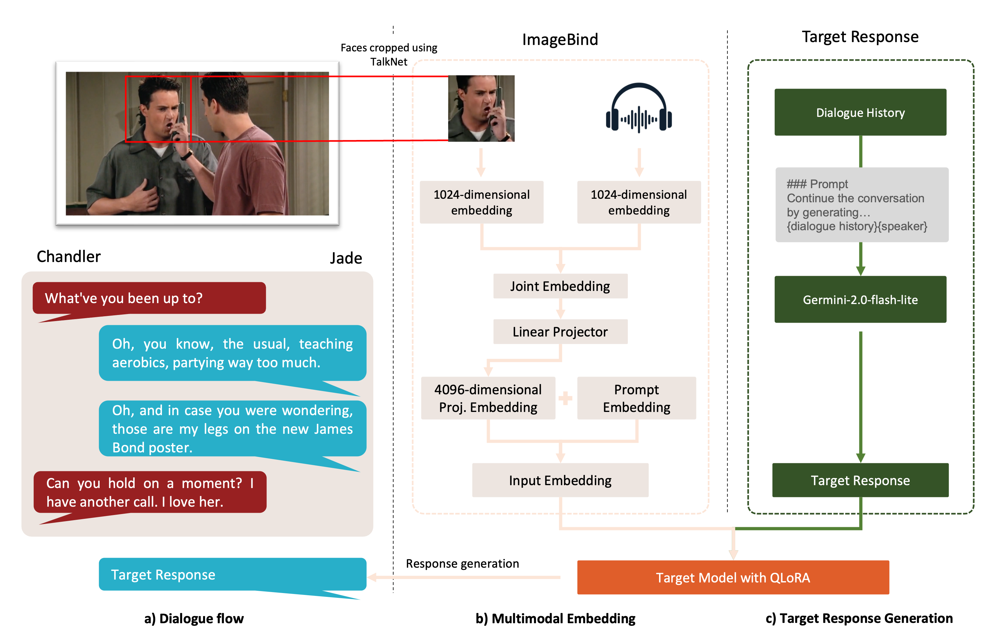

# Multimodal Empathetic Response Generation

This project explores the generation of empathetic dialogue responses by leveraging **multimodal signals**—text, audio, and visual cues—using the [MELD dataset](https://affective-meld.github.io/) and **ImageBind** for joint modality representation. Inspired by recent work on personality-aware multimodal generation, we propose a streamlined pipeline that fuses modalities through early fusion and integrates them into large language models using parameter-efficient fine-tuning.

---

## 🧠 Problem Motivation

Empathetic dialogue systems must understand **tone**, **facial expression**, and **language** to generate emotionally aligned responses. Most models only use text. Our goal is to enhance emotional understanding through **multimodal fusion**, improving alignment with the emotional and sentiment context of conversations.

---

## 🧰 Method Overview

We propose a **multimodal LLM (Empathetic MLLM)** framework:

- 🔊 Extracted audio waveforms using `ffmpeg`
- 🎥 Cropped speaker faces using **TalkNet** for active speaker detection
- 🧠 Encoded audio-visual features with **ImageBind**
- ➕ Combined them into a joint embedding via early fusion
- ⬇️ Projected the embedding into the LLM space and prepended it to the prompt
- 🧪 Fine-tuned LLaMA-3 and Mistral using **QLoRA (LoRA + 4-bit quantization)**

---

## 📊 Dataset

We used the **MELD** dataset which contains:
- 13k+ utterances
- Annotated emotions and sentiments
- Multimodal data (audio, video, text)

To ensure cleaner emotion extraction, we filtered and cropped to speaker-visible utterances, reducing the set to:
- 9,648 training
- 1,058 development
- 2,414 test examples

---

## 🔬 Evaluation Metrics

We evaluated models across four dimensions:

- **Fluency** (Perplexity)
- **Diversity** (Dist-1, Dist-2)
- **Semantic Similarity** (BERTScore)
- **Polarity Alignment**:  
  - Emotion score using [`bhadresh-savani/distilbert-base-uncased-emotion`](https://huggingface.co/bhadresh-savani/distilbert-base-uncased-emotion)  
  - Sentiment score using VADER  
  - Empathy score = average of Emotion + Sentiment

---

## 🏆 Results Summary

We evaluated our **Empathetic MLLM** (Multimodal Large Language Model) against both pretrained and fine-tuned **text-only baselines** on the synthetic MELD dataset. Metrics include fluency (PPL), diversity, semantic similarity, and polarity alignment (emotion, sentiment, empathy).

| **Method**                 | **Model**                        | **PPL ↓** | **Dist-2 ↑** | **BERTScore F1 ↑** | **Emotion ↑** | **Sentiment ↑** | **Empathy ↑** |
|---------------------------|----------------------------------|-----------|--------------|--------------------|----------------|------------------|---------------|
| Text-Only (Pretrained)    | Mistral-7B                       | 23.56     | **0.3110**   | 0.8765             | 0.58           | 0.69             | 0.63          |
|                           | LLaMA-3-8B                       | 34.18     | 0.2627       | 0.9022             | 0.64           | 0.72             | 0.68          |
| Text-Only (Fine-Tuned)    | Mistral-7B                       | 17.82     | 0.1965       | 0.8891             | 0.56           | 0.68             | 0.62          |
|                           | LLaMA-3-8B                       | **3.84**  | 0.1585       | 0.8656             | **0.67**       | **0.73**         | **0.70**      |
| **Empathetic MLLM (Ours)**| Mistral-7B  (**text + audio + video**) | 22.35     | 0.2907       | **0.8919**         | 0.59           | 0.67             | 0.63          |
|                           | LLaMA-3-8B  (**text + audio + video**) | 28.91     | **0.3260**   | 0.8817             | 0.54           | 0.64             | 0.59          |

### 🔍 Key Takeaways

- Fine-tuned **text-only LLaMA-3-8B** achieved the **lowest perplexity** and highest **empathy score**.
- **Empathetic MLLMs** maintained **competitive polarity alignment**, while improving **diversity** (Dist-2) and achieving top **BERTScore F1** (Mistral variant).
- Multimodal inputs help preserve **lexical richness** and **semantic coherence** in responses.

---

## 🤝 Contributors

- **Sean Gai** – Audio extraction, MLLM implementation  
- **Zach Daniels** – Target response generation, polarity evaluation  
- **Jiwon Hae** – Face cropping, LLaMA MLLM fine-tuning  

---

## 📄 Full Report

For detailed methodology, experiments, and analysis, please refer to the full technical report:

👉 [**Multimodal Empathetic Response Generation – Full Report (PDF)**](multimodal_mllm.pdf)
